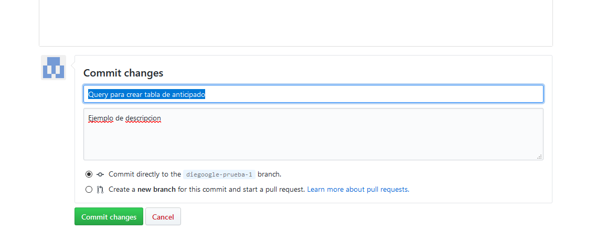

# AzQ
Queries for Rocket, Sas, Acces, Sql
Este repositorio tiene como objetivo almacenar queries de utilidad que podamos compartir entre nosotros.

*Podemos agregar nuevos queries, dando clic en Create new file:

*Para cargar el query solo lo escribimos en el espacio que nos da la plataforma:

*Tambien podemos modificiar los queries, dando clic al lapiz en caso de que queramos mejorarlo.

*Despues de editar o crear un query nuevo, nos desplazamos hacia abajo y dejamos un "Commit".
Adicionalmente podemos dejar una breve descripcion.
**Un commit es un comentario pequeño acerca de lo que estas haciendo, en este caso, para lo que sirve el query.

