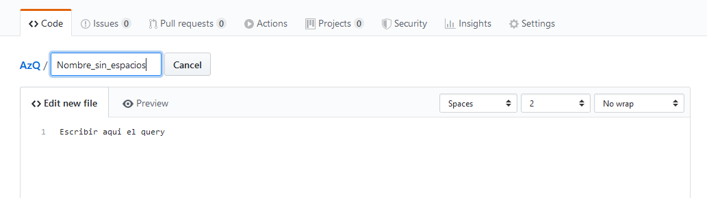
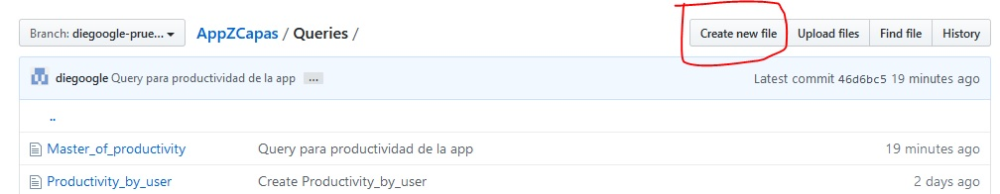
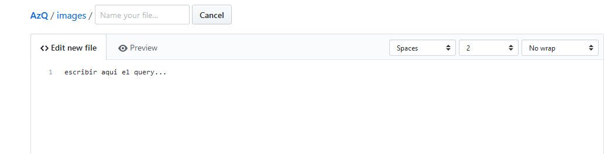
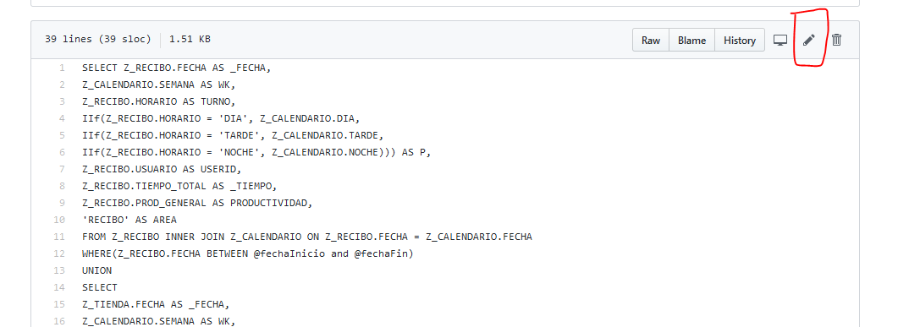
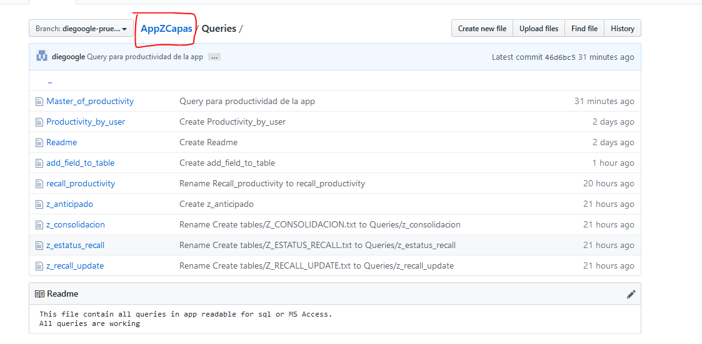

# Instrucciones

**Si es la primera vez que visitas este repositorio, lee lo siguiente
Este repositorio tiene como objetivo guardar y compartir queries de las diferentes plataformas que utilizamos los integrantes del equipo de Ingenieria.**

**-El repositorio es privado y solo compartido entre integrantes del equipo-**

## Navegacion
-Un repositorio maneja una navegacion entre carpetas similar a la navegacion en Windows
-Clic en la carpeta que desees para entrar

## Agregar queries
-Podemos agregar nuevos queries, dando clic en Create new file

## Escribir el texto
*Para cargar el query solo lo escribimos en el espacio que nos da la plataforma*

## Modificacion
*Tambien podemos modificiar los queries, dando clic al lapiz en caso de que queramos mejorarlo.

## Guardar cambios
*Despues de editar o crear un query nuevo, nos desplazamos hacia abajo y dejamos un "Commit".
*Adicionalmente podemos dejar una breve descripcion.
**Un commit es un comentario pequeño acerca de lo que estas haciendo, en este caso, para lo que sirve el query**

## Regresar
*Clic en las carpetas para moverte.*
**Clic en la carpeta principal para regresar a la carpeta raiz.**

